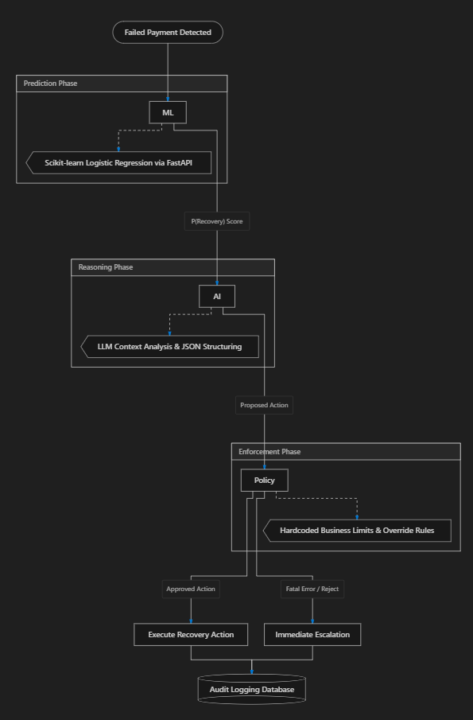
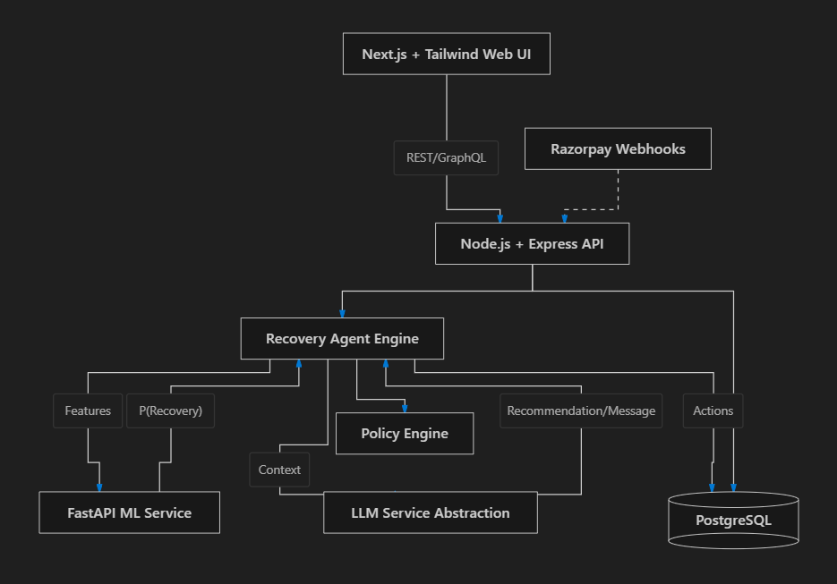
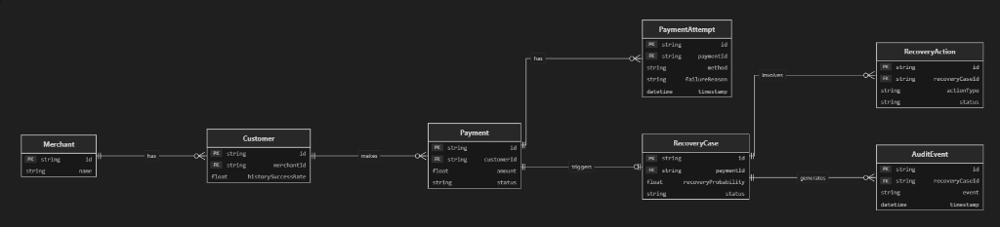

# RecoverAI

An AI-driven Revenue Recovery Agent demonstrating how statistical Machine Learning and generative Language Models can securely assist fintech pipelines while being constrained by deterministic safety rules.

## Problem
Failed payments create lost revenue and immediate customer friction. However, blindly retrying failed payments incurs high network costs, can trigger fraud alerts, and damages customer trust. Most recovery systems rely on brittle, hardcoded rules that fail to account for contextual nuances.

## Solution
RecoverAI solves this by chaining three distinct intelligence layers:
1. **ML Prediction:** Evaluates payment facts to predict a mathematical recovery probability.
2. **AI Recommendation:** Contextualizes the probability with qualitative reasons, proposing dynamic actions and personalized customer messages.
3. **Deterministic Policy Validation:** A rigid, hardcoded safety engine that intercepts the AI recommendation, validating it against strict financial rules (e.g. max retries, minimum threshold limits) and overriding the AI when necessary.

## System Architecture

### 1. Pipeline Flow


### 2. Architecture Diagram


### 3. Database ER Diagram


## Key Features
- **Statistical ML Prediction:** FastAPI microservice serving Logistic Regression inference.
- **Bounded AI Recommendations:** Prompt-guided LLM actions validated by Zod schemas.
- **Deterministic Safety Policy:** Impenetrable rule engine capable of rejecting unsafe AI decisions.
- **Synthetic Payment Simulation:** Procedurally generated training and testing data free from PII.
- **Chronological Audit Trail:** Immutable JSON tracking of the entire ML -> AI -> Policy lifecycle.
- **Full-Stack Visualization:** Next.js App Router dashboard rendering real-time performance and audit timelines.

## Tech Stack
- **Frontend:** Next.js (App Router), React, Tailwind CSS
- **Backend API:** Node.js, Express, TypeScript, Zod
- **Database:** PostgreSQL, Prisma ORM
- **Machine Learning:** Python, FastAPI, scikit-learn, joblib
- **Testing:** Vitest (TypeScript), Pytest (Python)

## ML Model Details
The baseline prediction model is a calibrated Logistic Regression classifier.
- **Training Data:** 25,000 synthetically generated payment records with latent patterns.
- **ROC-AUC:** 0.789
- **Brier Score:** 0.163
*Note: These metrics reflect the synthetic prototype environment and are not based on production Razorpay data.*

## AI Agent Integration
The system integrates an `LLMProvider` abstraction. For deterministic testing and rapid continuous integration, it currently utilizes a `MockLLMProvider` that returns schema-compliant reasoning mapped to the input context. The architecture seamlessly supports swapping to OpenAI or Gemini via standard API keys. The AI is strictly a recommendation layer; it has no direct execution privileges.

---

## Running Locally

### Prerequisites
- Node.js (v18+)
- Python (3.10+)
- PostgreSQL (v14+)

### 1. Database Setup
Ensure PostgreSQL is running. Copy the environment variables:
```bash
cp .env.example .env
```
*(Update `DATABASE_URL` in `.env` to match your local PostgreSQL credentials).*

Push the schema and generate Prisma client:
```bash
npm run db:push
npm run db:generate
```

### 2. ML Service Setup
Initialize the Python virtual environment and start FastAPI:
```bash
cd services/ml
python -m venv venv
venv\Scripts\activate   # (Windows)
# source venv/bin/activate (Mac/Linux)
pip install -r requirements.txt
uvicorn app.main:app --port 8000
```

### 3. Backend & Frontend Startup
Open a new terminal at the project root and install workspace dependencies:
```bash
npm install
```

Start the API and Web workspaces concurrently:
```bash
npm run dev
```
- The API will start on `http://localhost:4000`
- The Dashboard will start on `http://localhost:3000`

### 4. Running a Simulation
Open `http://localhost:3000` in your browser. Navigate to the **Simulation** tab and click "Run Simulation" to generate test payments and process them through the end-to-end pipeline.

---

## Testing
The repository employs extensive automated testing:
```bash
# Run TypeScript API & Web Tests (Vitest)
npm test

# Run Python ML Tests (Pytest)
cd services/ml && pytest tests/
```

## Limitations & Future Work
- **Synthetic Data:** The system currently relies on synthetic datasets. Real-world payments experience concept drift and complex seasonality.
- **Sequential Simulation:** The current simulation processes batches sequentially to avoid SQLite/DB deadlocks in dev, though the architecture supports asynchronous queueing.
- **Future Integration:** Adding robust queueing (e.g., BullMQ) and tying the `POST /evaluate` endpoint to real Razorpay Webhooks.
